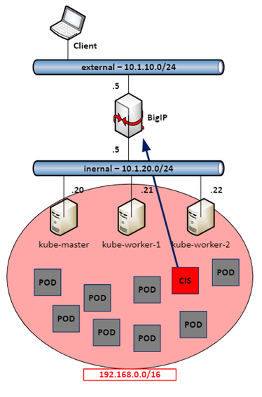

.. _pre-work:

.. raw:: html

   

.. role:: red

.. raw:: html

   

.. role:: blue

Pre Work & additional reading
=============================

Lab Information - Overview
--------------------------

This Lab has several components:

1. Kubernetes Cluster (1 Master with kubectl installed; 2 Worker Nodes)

   * IP 10.1.20.20 (master)
   * 10.1.20.21 (Worker I)
   * 10.1.20.22 (Worker II)

2. F5 Big IP with AS3 installed

   * IP 10.1.10.5 (external VLAN); 10.1.20.5 (internal VLAN)

3. external client

   * IP 10.1.10.250

|

Calico overlay network is a **192.168.0.0/16**

.. warning::
   If set up properly, you set up the kubadm init with "--pod-network-cidr=192.168.0.0/16".

   One side must have the correct config of the other. In this case, we assigned the k8s cluster the default CIDR from Calico

Steps already done from this lab Guide
++++++++++++++++++++++++++++++++++++++

The base for this lab is *Nicolas Menant's* calico demo guide (see next chapter for futher information).

For this lab guide, I already installed k8s and installed the k8s apps:

   * :blue:`[kube-master & nodes]` OS, packet repository & package updates (apt-get update, ...)

   * :blue:`[kube-master & nodes]` installed Docker

   * :blue:`[kube-master & nodes]` installed kubeadm & k8s

   * :blue:`[kube-master]` installed calico

   * :blue:`[nodes]` Added kube worker to kube master

   * :red:`[bigip]` created "kubernetes" partition in F5

   * :red:`[bigip]` installed AS3 iAppLX on f5

   * :blue:`[kube-master]` Created Deplyoment and Service for apps in:

     * config maps apps (001_as3-1_app.yaml & 001_as3-2_app.yaml)

     * ingress dedicated apps (001a_apps.yaml)

     * ingress shared apps (001b_apps-shared.yaml)

     * Created Secret Username & Service Account

       * kubectl create secret generic bigip-login --namespace kube-system --from-literal=username=admin --from-literal=password=<password>

       * kubectl create serviceaccount bigip-ctlr -n kube-system

     * Created RBAC

       * in k8s/cis folder: kubectl apply -f 001_f5-k8s-sample-rbac

External Ressources / Reading
-----------------------------

Calico Lab
++++++++++

The lab itself is based on the Lab Guide from *Nicolas Menant*, which can be found on Dev Central:

* `F5 & Calico Part I <https://devcentral.f5.com/s/articles/CIS-and-Kubernetes-Part-1-Install-Kubernetes-and-Calico>`_
* `F5 & Calico Part II <https://devcentral.f5.com/s/articles/CIS-and-Kubernetes-Part-2-Install-F5-Container-ingress-services>`_

If you plan to set up this lab in your own environment, I recommend to use this guide, as it also includes how to set up a basic k8s cluster.

Calico SDN
++++++++++

To better understand the Calico SDN, I recommend to have a look into the video below - it was created by one of the developers from tigera and does a pretty good job in explaining the calico SDN. Basically everything is based on routing - so if you are, like me, a more network focused guy, you'll find this very easy, once the video is over.

.. raw:: html

   

<a href="https://www.tigera.io/video/tigera-calico-fundamentals?wvideo=1h2w5xt3sv">Tigera Calico - Architecture &amp; Networking Fundamentals Video | Tigera</a>

.. admonition:: For the impatient ...

   00:52 - ~20:00 is the most important part

.. admonition:: For the techer's pets ...

      I use this first part of the video to show case calico to partner and cutomers - and generally it is well received

Check if all required services are running
------------------------------------------

Check Nodes
+++++++++++

**From kubernetes master (10.1.10.20)**

Check if the nodes are up & ready::

  ubuntu@ip-10-1-1-4:~/tmp$ kubectl get nodes
  NAME          STATUS   ROLES    AGE    VERSION
  ip-10-1-1-4   Ready    master   159d   v1.13.4
  ip-10-1-1-5   Ready    <none>   159d   v1.13.4
  ip-10-1-1-6   Ready    <none>   159d   v1.13.4

You should see 3 nodes - the master node and two worker nodes. Status must be :red:`"Ready"`

Check Deployments
+++++++++++++++++

**From kubernetes master (10.1.10.20)**

As said before, we already did some preparation work - this includes setting up basic application deployments.

Check if deployments are up in default namespace::

    ubuntu@ip-10-1-1-4:~/tmp$ kubectl get deployments
    NAME                  READY   UP-TO-DATE   AVAILABLE   AGE
    coffee                2/2     2            2           159d
    coffee-2              2/2     2            2           158d
    f5-hello-world        2/2     2            2           159d
    f5-hello-world-2      2/2     2            2           158d
    f5-hello-world-web1   2/2     2            2           158d
    f5-hello-world-web2   2/2     2            2           158d
    tea                   2/2     2            2           159d
    tea-2                 2/2     2            2           158d

You should see several "coffe", "tea" and "f5-hello-world deployments"

Check Services
++++++++++++++

**From kubernetes master (10.1.10.20)**

We also prepared k8s services - we use :red:`ClusterIP` type of service, as we are part of the overlay network and can access the services directly.

Check services in default namespace::

    ubuntu@ip-10-1-1-4:~/tmp$ kubectl get svc
    NAME                  TYPE        CLUSTER-IP       EXTERNAL-IP   PORT(S)          AGE
    coffee-svc            ClusterIP   10.107.30.67     <none>        80/TCP           159d
    coffee-svc-2          ClusterIP   10.106.111.105   <none>        80/TCP           158d
    f5-hello-world        ClusterIP   10.108.63.209    <none>        80/TCP           159d
    f5-hello-world-2      ClusterIP   10.111.153.216   <none>        80/TCP           158d
    f5-hello-world-web1   NodePort    10.106.118.98    <none>        8080:31233/TCP   158d
    f5-hello-world-web2   NodePort    10.107.254.202   <none>        8080:31872/TCP   158d
    kubernetes            ClusterIP   10.96.0.1        <none>        443/TCP          159d
    tea-svc               ClusterIP   10.98.6.220      <none>        80/TCP           159d
    tea-svc-2             ClusterIP   10.106.45.120    <none>        80/TCP           158d

.. admonition:: For the careful reader ...

          Two services are deplyoed with "NodePort". Those are services are already accessible from external [curl <worker-node-ip>:<nodeport>].

          To test this, login to :red:`bigip (10.1.10.5)` and::

              [admin@ip-10-1-1-7:Active:Standalone] ~ # curl http://10.1.20.21:31233
              <!--
                  f5-hello-world - Main Page
                  https://github.com/f5devcentral/f5-hello-world
                  Artiom Lichtenstein
                  v2.2.0, 19/12/2017
              -->
              <!DOCTYPE html>
              <html lang="en">
                  <head>
                        <!-- Basic Page Needs
              [...]

.. toctree::
   :maxdepth: 2
