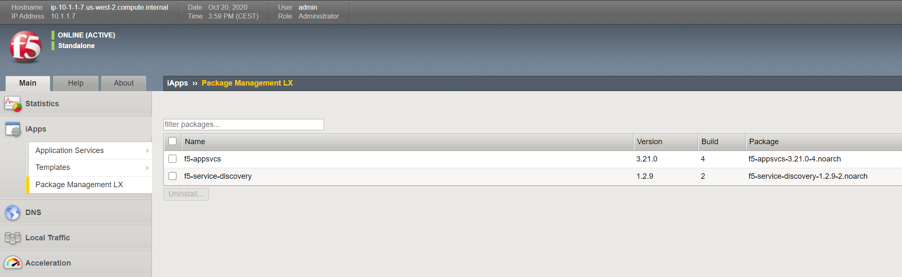
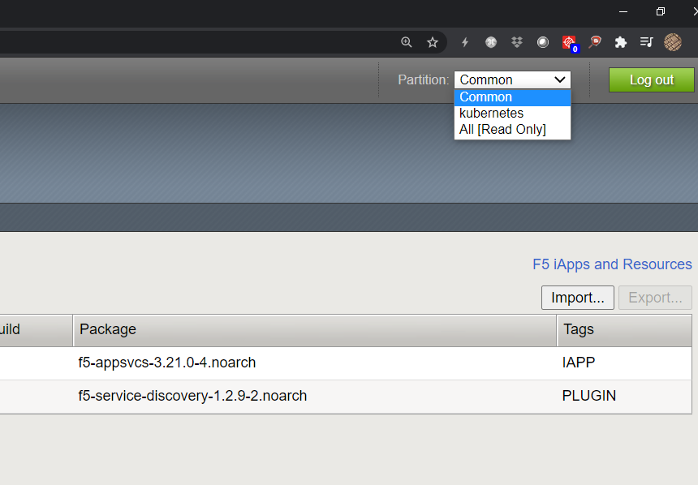

.. _k8s-basic-ingress:

.. raw:: html

   

.. role:: red

.. raw:: html

   

.. role:: blue

Installing & testing basic k8s ingress services
===============================================

Prerequisite for ingress services
---------------------------------

Following tasks have to be done, in order to start configuring basic ingress services.

Install AS3 on :red:`bigip`.

Login to :red:`bigip (10.1.10.5)` via TMUI (Web UI)

========  ========  ==========
 Device   Username   Password
========  ========  ==========
 bigip     admin    f5twister!
========  ========  ==========

Check if AS3 is installed (iApps > Package Management LX):

Communication from BigIP Controller for Controller Ingress Service is using AS3.
In the current lab, we installed **3.21.0**

Check if basic Partition is installed (Check Partition in the top right):

|
|
|
|
|
|
|
|
|
|
|
|
|
|
|
|
|
|
|
| We need to specify a default partition in the controller config - this one must match the local partition.
|
| We should see partition **kubernetes**

Get latest yaml repro
---------------------

Login to :blue:`k8s master (10.1.20.20)`::

    ubuntu@ip-10-1-1-4:~$ cd ~
    ubuntu@ip-10-1-1-4:~$ pwd
    /home/ubuntu
    ubuntu@ip-10-1-1-4:~$ svn export https://github.com/de1chk1nd/F5k8sCalicoLab/trunk/k8s /home/ubuntu/k8s --force
    A    k8s
    A    k8s/cis
    A    k8s/cis/001_f5-k8s-sample-rbac.yaml
    A    k8s/cis/002_setup_cis_bigip.yaml
    A    k8s/config-map
    A    k8s/config-map/as3-1
    A    k8s/config-map/as3-1/001_as3-1_app.yaml
    A    k8s/config-map/as3-1/002_as3-1_configmap.yaml
    A    k8s/config-map/as3-2
    A    k8s/config-map/as3-2/001_as3-2_app.yaml
    A    k8s/config-map/as3-2/002_as3-2_configmap.yaml
    A    k8s/ingress
    A    k8s/ingress/001a_apps.yaml
    A    k8s/ingress/001b_apps-shared.yaml
    A    k8s/ingress/002a_app1.yaml
    A    k8s/ingress/002b_app2.yaml
    A    k8s/ingress/002c_app3.yaml
    A    k8s/ingress/003a_shared-app1.yaml
    A    k8s/ingress/003b_shared-app2.yaml
    A    k8s/ingress/003c_shared-app3.yaml

Install BigIP Controller
------------------------

Login to :blue:`k8s master (10.1.20.20)`.

Check local CIS deployment files in **/k8s/cis/**

001_f5-k8s-sample-rbac.yaml was deployed as part of the pre work (not part of this exercise)::

    ubuntu@ip-10-1-1-4:~$ cd k8s/cis/
    ubuntu@ip-10-1-1-4:~/k8s/cis$ ll
    total 16
    drwxrwxr-x 2 ubuntu ubuntu 4096 Oct 19 22:20 ./
    drwxrwxr-x 5 ubuntu ubuntu 4096 May 14 11:01 ../
    -rw-rw-r-- 1 ubuntu ubuntu  984 Oct 19 18:16 001_f5-k8s-sample-rbac.yaml
    -rw-rw-r-- 1 ubuntu ubuntu 1830 Oct 19 18:16 002_setup_cis_bigip.yaml

Deploy CIS Controller with **002_setup_cis_bigip.yaml** config file::

    ubuntu@ip-10-1-1-4:~/k8s/cis$ kubectl apply -f 002_setup_cis_bigip.yaml
    deployment.apps/k8s-bigip1-ctlr-deployment created

Check if the controller is in :red:`Running` state. We installed the controller in another namespace as the "default" - so we need to specify the namespace with the *kubectl* command (BigIP Controller start with *k8s-bigip1-ctlr-*)::

    ubuntu@ip-10-1-1-4:~/k8s/cis$ kubectl get pods -n kube-system
    NAME                                         READY   STATUS    RESTARTS   AGE
    calico-kube-controllers-6c46b94ccf-jrv96     1/1     Running   8          159d
    calico-node-dkg6m                            1/1     Running   8          159d
    calico-node-lpz4m                            1/1     Running   8          159d
    calico-node-x7xk6                            1/1     Running   8          159d
    coredns-54ff9cd656-6vm62                     1/1     Running   8          159d
    coredns-54ff9cd656-v6vww                     1/1     Running   8          159d
    etcd-ip-10-1-1-4                             1/1     Running   14         159d
    k8s-bigip1-ctlr-deployment-7684f87fc-ncxnx   1/1     Running   0          43s
    kube-apiserver-ip-10-1-1-4                   1/1     Running   15         159d
    kube-controller-manager-ip-10-1-1-4          1/1     Running   8          159d
    kube-proxy-cwzqd                             1/1     Running   8          159d
    kube-proxy-fkzgx                             1/1     Running   8          159d
    kube-proxy-t2vgl                             1/1     Running   8          159d
    kube-scheduler-ip-10-1-1-4                   1/1     Running   8          159d

example code k8s-bigip1-ctlr-deployment::

    apiVersion: apps/v1
    kind: Deployment
    metadata:
     name: k8s-bigip1-ctlr-deployment
     namespace: kube-system
    spec:
     selector:
       matchLabels:
         app: k8s-bigip1-ctlr
     # DO NOT INCREASE REPLICA COUNT
     replicas: 1
     template:
       metadata:
         labels:
           app: k8s-bigip1-ctlr
       spec:
         # Name of the Service Account bound to a Cluster Role with the required
         # permissions
         serviceAccountName: bigip-ctlr
         containers:
           - name: k8s-bigip-ctlr
             image: "f5networks/k8s-bigip-ctlr:latest"
             env:
               - name: BIGIP_USERNAME
                 valueFrom:
                   secretKeyRef:
                     # Replace with the name of the Secret containing your login
                     # credentials
                     name: bigip-login
                     key: username
               - name: BIGIP_PASSWORD
                 valueFrom:
                   secretKeyRef:
                     # Replace with the name of the Secret containing your login
                     # credentials
                     name: bigip-login
                     key: password
             command: ["/app/bin/k8s-bigip-ctlr"]
             args: [
               # See the k8s-bigip-ctlr documentation for information about
               # all config options
               # https://clouddocs.f5.com/products/connectors/k8s-bigip-ctlr/latest
               "--bigip-username=$(BIGIP_USERNAME)",
               "--bigip-password=$(BIGIP_PASSWORD)",
               "--bigip-url=10.1.20.5",
               "--bigip-partition=kubernetes",
               "--insecure=true",
               "--pool-member-type=cluster",
               "--agent=as3",
               "--default-ingress-ip=10.1.10.85"
               ]
         imagePullSecrets:
           # Secret that gives access to a private docker registry
           - name: f5-docker-images
           # Secret containing the BIG-IP system login credentials
           - name: bigip-login

See :download:`Example Code on github <https://github.com/de1chk1nd/F5k8sCalicoLab/blob/main/k8s/cis/002_setup_cis_bigip.yaml>`

.. toctree::
   :maxdepth: 2
