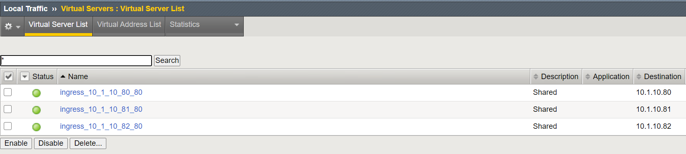
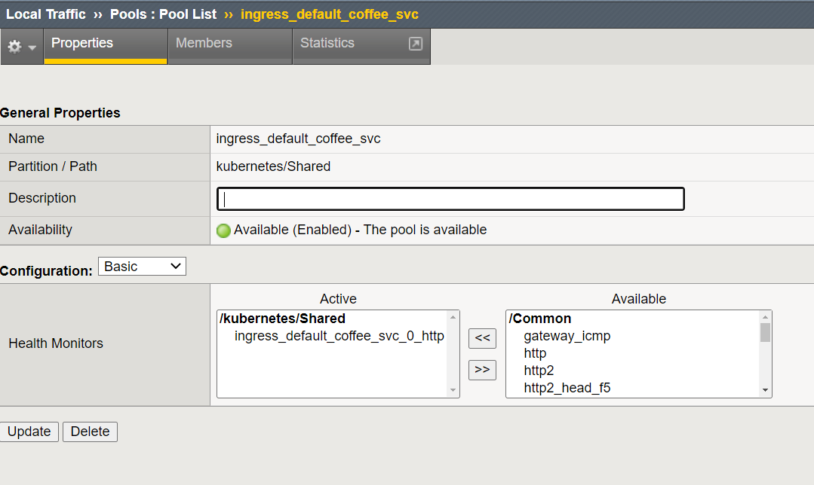

.. _k8s-basic-ingress-service:

.. raw:: html

   

.. role:: red

.. raw:: html

   

.. role:: blue

Basic Ingress Service
=====================

Now we are getting closer ;)

In this chapter we will deploy the first, basic ingress services.

Deploy "dedicated" Ingress Services
-----------------------------------

Login to :blue:`k8s master (10.1.20.20)`::

    ubuntu@ip-10-1-1-4:~/k8s/ingress$ cd /home/ubuntu/k8s/ingress
    ubuntu@ip-10-1-1-4:~/k8s/ingress$ kubectl apply -f 002a_app1.yaml
    ingress.extensions/singleingress1 created
    ubuntu@ip-10-1-1-4:~/k8s/ingress$ kubectl apply -f 002b_app2.yaml
    ingress.extensions/singleingress2 created
    ubuntu@ip-10-1-1-4:~/k8s/ingress$ kubectl apply -f 002c_app3.yaml
    ingress.extensions/singleingress3 created

Check if *ingress* is running in k8s::

    ubuntu@ip-10-1-1-4:~/k8s/ingress$ kubectl get ingress
    NAME             HOSTS   ADDRESS      PORTS   AGE
    singleingress1   *       10.1.10.80   80      22s
    singleingress2   *       10.1.10.81   80      15s
    singleingress3   *       10.1.10.82   80      7s

Login to :red:`bigip (10.1.10.5)` via TMUI (Web UI).

Please check **[in partition kubernetes]** created services by ingress service

We can see three services - each listening on another IP address on port 80. As defined in the ingress definition, we route:

* 10.1.10.80:80 to coffee
* 10.1.10.81:80 to tea
* 10.1.10.82:80 to f5 hello world

.. admonition:: Ingress Service

      What **kubernetes.io** says about ingress services:

      Ingress exposes HTTP and HTTPS routes from outside the cluster to services within the cluster. Traffic routing is controlled by rules defined on the Ingress resource.

      An Ingress may be configured to give Services externally-reachable URLs, load balance traffic, terminate SSL / TLS, and offer name-based virtual hosting. An Ingress controller is responsible for fulfilling the Ingress, usually with a load balancer, though it may also configure your edge router or additional frontends to help handle the traffic.

      An Ingress does not expose arbitrary ports or protocols. Exposing services other than HTTP and HTTPS to the internet typically uses a service of type Service.Type=NodePort or Service.Type=LoadBalancer.

So Ingress definitions create L7 Services. Each application can use different annotations, to augment the L7 Service creation (http/SNAT/SSL Profiles/...).

Please check the Schema definition on clouddocs.f5.com for current supported annotations.

Lets have a look into the coffee service:

Again - f5 CIS controller created a complete f5 config via AS3:

* Virtual Server
* Pool
* Pool Member
* Nodes

If we check the Pool Member, we can see the POD IP and POD Ports

Have a look on one pod on k8s to cross check::

    ubuntu@ip-10-1-1-4:~/k8s/ingress$ kubectl describe pod coffee-6567c98884-54qnd
    Name:               coffee-6567c98884-54qnd
    Namespace:          default
    Priority:           0
    PriorityClassName:  <none>
    Node:               ip-10-1-1-5/10.1.1.5
    Start Time:         Wed, 13 May 2020 16:24:21 +0000
    Labels:             app=coffee
                        pod-template-hash=6567c98884
    Annotations:        cni.projectcalico.org/podIP: 192.168.43.82/32
    Status:             Running
    IP:                 192.168.43.82
    Controlled By:      ReplicaSet/coffee-6567c98884
    Containers:
      coffee:
        Container ID:   docker://c5a8dd47fd3905d570648d72559e84d295d62f5dc9faf72e0af4dfaa08e4b50b
        Image:          nginxdemos/nginx-hello:plain-text
        Image ID:       docker-pullable://nginxdemos/nginx-hello@sha256:71b4a63b6d31ae846c431d0dc7134bc0ae490fe4698eebf3ed297668db3b2939
        Port:           8080/TCP

Test & Scale out Services
-------------------------

Login to :blue:`client (10.1.10.250)`::

    ubuntu@ip-10-1-1-8:~$ curl 10.1.10.80
    Server address: 192.168.43.82:8080
    Server name: coffee-6567c98884-54qnd
    Date: 20/Oct/2020:15:05:25 +0000
    URI: /
    Request ID: d77a109d8b204af78e0a33962e0f1635

We get the coffee service from an external client via the BigIP - service created by CIS controller inside k8s.

But what happens during spike traffic - and dev needs to scale out?

Remember - currently we have two pool member in our coffee pool:

We have two pods running for coffee::

    ubuntu@ip-10-1-1-4:~/k8s/ingress$ kubectl get pods
    NAME                                   READY   STATUS    RESTARTS   AGE
    coffee-2-76f45cdb7b-qbfkr              1/1     Running   8          159d
    coffee-2-76f45cdb7b-r2zcb              1/1     Running   8          159d
    coffee-6567c98884-54qnd                1/1     Running   9          159d
    coffee-6567c98884-xngq9                1/1     Running   9          159d
    f5-hello-world-2-69bddf75fc-7bf5s      1/1     Running   8          159d
    [...]

Now start a scale out event::

    ubuntu@ip-10-1-1-4:~/k8s/ingress$ kubectl scale --current-replicas=2 --replicas=3 deployment/coffee
    deployment.extensions/coffee scaled

...and check running pods::

    ubuntu@ip-10-1-1-4:~/k8s/ingress$ kubectl get pods
    NAME                                   READY   STATUS    RESTARTS   AGE
    coffee-2-76f45cdb7b-qbfkr              1/1     Running   8          159d
    coffee-2-76f45cdb7b-r2zcb              1/1     Running   8          159d
    coffee-6567c98884-54qnd                1/1     Running   9          159d
    coffee-6567c98884-cvnws                1/1     Running   0          7s
    coffee-6567c98884-xngq9                1/1     Running   9          159d
    f5-hello-world-2-69bddf75fc-7bf5s      1/1     Running   8          159d

...finally check pool member on f5:

The extra mile... (optional lab)
---------------------------------

In the local k8s/ingress folder we have 3 additional services deployed:

* 003a_shared-app1.yaml
* 003b_shared-app2.yaml
* 003c_shared-app3.yaml

Deploy them ( **kubectl apply -f <filename>** ) and see what happens on the f5.

Some Questions which might be interesting:

* What is the difference compared to the previous services?
* How does the Service got it's ip address?
* How does the f5 know, how to route the traffic?

.. admonition:: Additional Ressources

   Following information might become important, to understand what happens:

   `Ingress Annotations <https://clouddocs.f5.com/containers/latest/userguide/ingress.html#supported-ingress-annotations>`_

   `Controller Definition <https://clouddocs.f5.com/products/connectors/k8s-bigip-ctlr/v1.11/#kubernetes>`_

Clean Up the lab
----------------

After finishing the lab, clean up the ingress services::

   | **Show ingress service:**
   |
   | ubuntu@ip-10-1-1-4:~/k8s/ingress$ kubectl get ingress
   | NAME             CLASS    HOSTS   ADDRESS   PORTS   AGE
   | singleingress1   <none>   *                 80      38s
   | singleingress2   <none>   *                 80      16s
   | singleingress3   <none>   *                 80      7s

   | **Delete ingress services:**
   |
   | ubuntu@ip-10-1-1-4:~/k8s/ingress$ kubectl delete ingress singleingress1
   | ingress.extensions "singleingress1" deleted
   |

.. toctree::
   :maxdepth: 2
